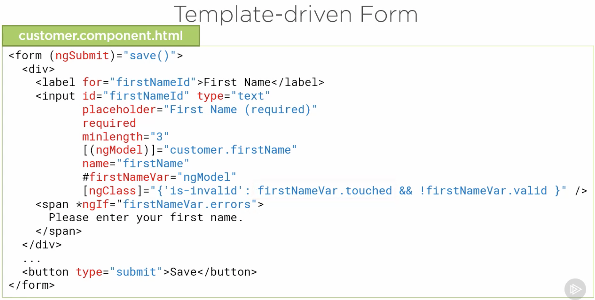
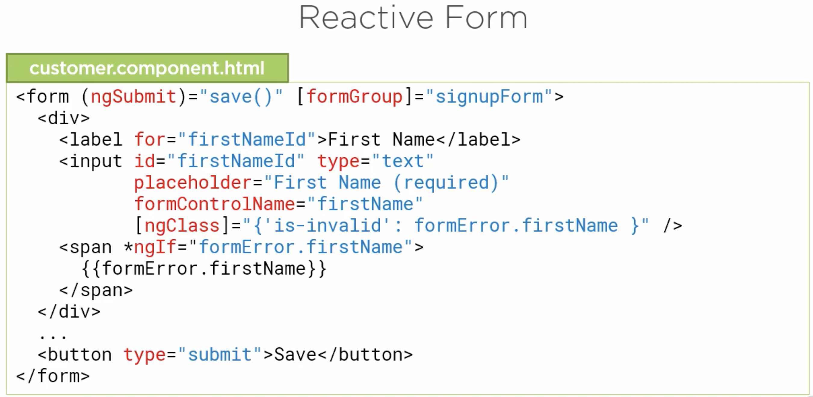

# Angular Reactive Forms
Materials for my Pluralsight course: ["Angular Reactive Forms"](https://app.pluralsight.com/library/courses/angular-2-reactive-forms).

`Demo-Start`: The starter files. **Use this to code along with the course**.

`Demo-Final`: The completed files. Use this to see the completed solution from the course.

`APM`: Angular reactive form in the context of a more full-featured application. Includes examples of CRUD (Create, Read, Update, and Delete) operations.

Angular v12 turns strict typing on by default. Angular forms is not very strongly typed, so some changes are required to support strict typing. Use these files if you are using Angular v12 or newer or if you turn on strict typing.

`demo-start-v12`: The starter files updated to Angular v12. I have made changes here

`demo-final-v12`: The completed files updated to Angular v12.

`apm-v12`: Angular reactive form in the context of a more full-featured application updated to Angular v12. Includes examples of CRUD (Create, Read, Update, and Delete) operations.

See the `README.md` file under each folder for details on installing and running the application.

Please see the `CHANGELOG.md` for the most recent changes to this repo.

### Template-Driven vs Reactive Forms

#### Template-Driven

* Easy to use
* 2 way databinding -> Minimal component code
* Automatically tracks form and input element state

#### Reactive

* More flexible and can handle more complex scenarios(Complex validation scenarios like User selection or other form state)
* Immutable data model
* Easier to perform an action on a value change(Like transforming to Uppercase or Partial Lookup)
* Access to Reactive tranformations such as DebounceTime or DistinctUntilChanged
* Can easily add input elements dynamically
* Easier Unit Testing

### Form States(Input Element and Form)

* Value
  * pristine: Unchanged
  * dirty: Changed
  * If all Input elements on a Form are Pristine, then the Form State is Pristine
  * If any Input element on a Form is Dirty, then the Form State is Dirty
* Validity
  * valid: If it passes all the defined Validation Rules
    * The Form itself is valid if all Input elements on the form are valid
  * errors: Array containing Validation errors
    * Key of each Array element is the name of the Validation rule associated with the Error
* Visited
  * touched: Visited an input element and then left the Input element
    * User has set focus into the Input and then left the Input element
    * A Form is touched if any input element has been touched
  * untouched

### Form Building Blocks

* FormControl: Tracks the value and state of an individual Input element(such as input box)
* FormGroup: Tracks the value and state of group of FormControls(such as for the form itself(*Root FormGroup*), group of input elements for a mailing address block etc)
* The above 2 are actually Classes provided when we work with Angular Forms
  * Instances of these classes define the Form Model
* Form Model: Data Structure that represents the HTML Form
  * Retains Form State like dirty, touched, valid, disabled etc
  * Retains Form Value in the value property
  * Tracks all of the FormControls
* Form Model is same for Template Driven and Reactive Forms but the way they are created is different

### Template-Driven Forms

* In Template
  * HTML in template for the Form element, each Input element, Data binding, Validation Rules using Attributes and Validation Error messages
  * Angular automatically generates the associated Form Model
* Component Class
  * Define Properties for data binding(data model)
  * Methods for form operations such as Submit

### Reactive Forms

* Shift the responsiblity for creating the Form Model to the Component class
* Template
  * Form element and Input element(s)
  * Binding to Form Model
* Component Class
  * Define Form Model
  * Validation rules and error messages
  * Properties for managing data(data model)
  * Methods for form operations such as submit

### Form Directives and imports

* Template-Driven(FormsModule)
  * ngForm: Automatically assigned by Angular when it detects a form
    * Angular creates a Form Model starting with the Root FormGroup instance and automatically binds it to the form
    * If we want to access form model, export ngForm directive into a template reference variable(#signUpForm="ngForm")
  * ngModel
    * Use this directive on each Input element to keep the Component class property in sync with the user-entered value
    * [(ngModel)]="customer.firstName"
    * 2 way data binding and name for keeping track of control
    * When ngModel is added to an input element within a form, Angular automatically creates a FormControl instance and adds it to the form model using the input element's name as the key
    * Access state by exporting ngModel directive into a template reference variable(#firstNameVar="ngModel")
  * ngModelGroup
* Reactive(ReactiveFormsModule)
  * formGroup
  * formControl
  * formControlName
  * formGroupName
  * formArrayName

### Template Syntax for Forms

* ngSubmit to call a method after Submit


* Template-Driven Forms
  * input element has validation attributes like minlength and required
  * 2 way data binding(using ngModel) and name attribute in input element
  * Template reference variable to check for errors and apply styling classes


* Reactive Forms
  * formGroup directive in form and attach to Form Model instance created in the class
  * formControlName in input
  * Validation attributes not present(as it is done in Class)

### Template-driven Form: Template

* Check customer.component.html in Demo-Start
* card, card-body, form-group row mb-2, form-control, is-invalid, invalid-feedback classes are from Bootstrap
* novalidate for disabling Browser validation
* signupForm is the Form Model reference and is passed to save method on Submit
* firstNameVar.dirty for showing the Validation error as the User types
* The errors collection would have the names of the validation rules as key(required and minlength) when there are errors
* is-invalid class for Red border
* is-invalid style class also updates the invalid-feedback for any sibling elements from display: none to display: block

### Template-driven Form: Component

* Check customer.component.ts in Demo-Start
* Properties for binding
* Methods for getting and saving data

### Complex Scenarios

* Template-driven gets quite complex for the below and Reactive Form is preferred
* Scenarios
  * Dynamically add input elements
  * Watch what the user types
  * Wait validation until typing stops
  * Different validation for different situations
  * Immutable data structures

### Reactive Form Component Class

* Form Model
  * Root FormGroup
  * FormControl for each input element(not necessarily for all)
  * Nested FormGroups as desired
  * FormArrays
* Import FormGroup in Component class and initialize it in ngOnInit
  * Note this is not done in Constructor because we want Component and Template to be initialized before building the Form Model
* FormGroup parameter is an object of FormControls
```ts
ngOnInit(): void {
  this.customerForm = new FormGroup({
    firstName: new FormControl(),
    lastName: new FormControl(),
    email: new FormControl(),
    sendCatalog: new FormControl(true) // Default value
  })
}
```
* We are gonna bind this FormGroup to the form in the template
* Form model defines the set of FormGroups and FormControls that match up with the HTML Form and Input elements
* Data model is what we are gonna send or receive from Backend

### Binding to the Template

* Check my changes in demo-start-v12 customer Component
* After creating the root FormGroup in the Component, bind it to the form with formGroup directive
  * For binding use property binding(i.e [])
* For tracking the input elements, use formControlName directive and the control name(as string)
* Accessing the Form Model Properties(For Styling, Display of Validation Error messages and other purposes)
  * Navigating through Form Model hierarchy
    * customerForm.controls.firstName.valid
  * Using FormGroup's get method
    * customerForm.get('firstName').valid
  * Separate property in the Component class
    * firstName = new FormControl();
    * this.customerForm = new FormGroup({firstName: this.firstName}, ...)
    * Then directly access firstName in the template
* Delete ngModel directive, name attribute, template reference variable
* Use formGroup and formControlName directives
* Replace template reference variable with customerForm.get('X')

### Using setValue and patchValue

* setValue: For setting the value for all the Form Controls
  * We get an Error if we don't provide for all the Form Controls
* patchValue: For setting the value for a subset of Form Controls

### Simpliying with FormBuilder

* Using FormBuilder simplies creation of the Form Model
* We no longer need to create to a new instance of FormGroup
* Instead we can inject FormBuilder and use its group method to create a Form Model
* The group method takes a Configuration object whose keys are the Control names and the value is the default value
* The value can be provided directly or using object or an Array
* When value is an Object
  * value key for the default value given directly before
  * disabled for making the input disabled or not
  * Making it disabled will not make it appear in the value property
* When value is an Array
  * The first item is the default value or the Object with value and disabled
  * Following it is the Validation rules

### Setting Built-in Validation Rules

* In the group method's object, for the values, we provide an Array whose 1st entry is the value, 2nd entry is a single Validation rule or list of Validation rules and the 3rd entry is the Async Validators
* Async Validators for Asynchrounous validation like calling a Server side validation method
* Async Validators don't run until all synchronous validators pass validation
```ts
this.customerForm = this.fb.group({
  firstName: ['', [Validators.required, Validators.minLength(3)]],
  lastName: ['', Validators.required],
  sendCatalog: true
})
```